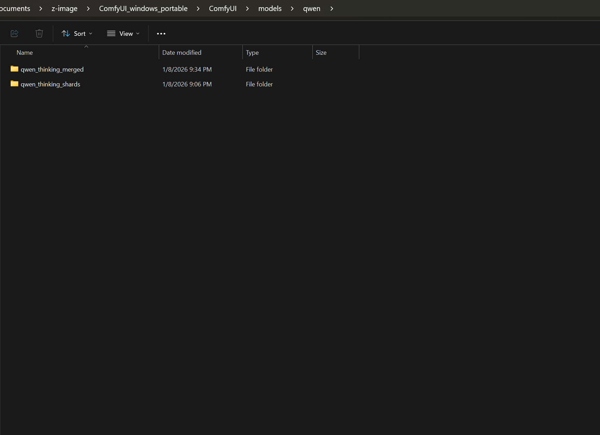
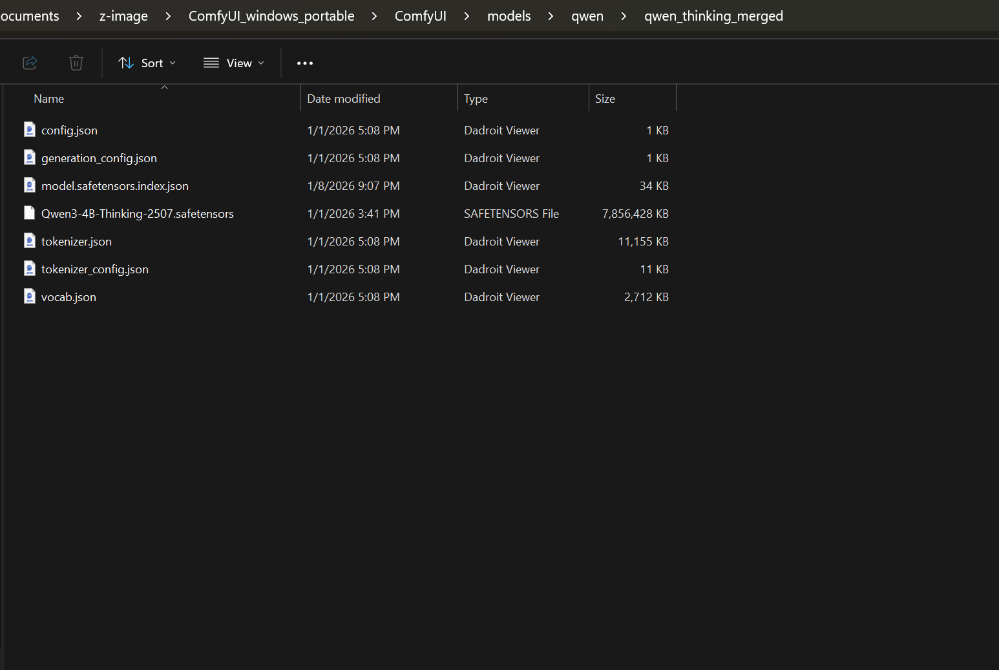
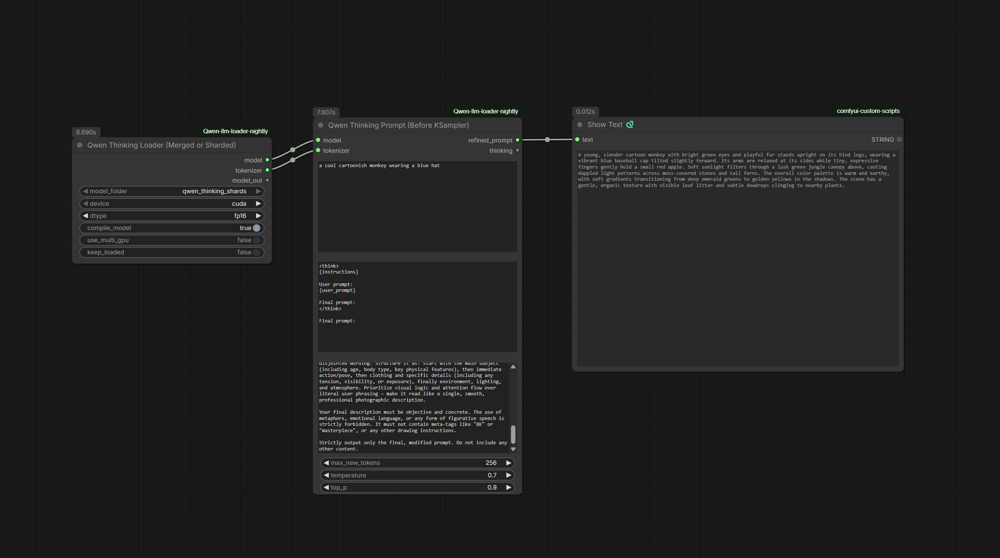

# Qwen-llm-loader
Local Qwen loader and prompt refiner for ComfyUI.
# ComfyUI-llm-loader

Local Qwen3-4B-Thinking-2507/ Qwen3_4b loader/ general LLM models and prompt refiner for ComfyUI.

This custom node lets you load the Qwen3-4B-Thinking-2507 or any LLM model completely offline and use it to refine text prompts with full control over the instructions. It supports visible thinking output, and optional full memory unloading to free VRAM after use.

## Features
- Fully local loading (no internet required after downloading the model)
- Flexible prompt template and instruction bodies
- Visible chain-of-thought ("thinking") output
- Optional keep_loaded toggle to completely unload the model from GPU and RAM
- Works with any Stable Diffusion workflow

## Installation

1. Clone or download this repository into your `ComfyUI/custom_nodes/` folder:
2. (or download as ZIP and extract)

2. Download the model files, For this example I'm using Qwen3-4B-Thinking-2507 (download all repo files):  
https://huggingface.co/Qwen/Qwen3-4B-Thinking-2507

OR
   Download the merged model files from here (download all repo files):
https://huggingface.co/Capitan01R/qwen-thinking-merged/tree/main/qwen_thinking_merged

4. Place all files (`config.json`, `tokenizer.*`, `*.safetensors`, `model.safetensors.index.json` or shards, and any `.py` files) into:  
`ComfyUI/models/qwen/downloaded-model-folder`
folder structure:

then inside the qwen/model-folder/files

6. Restart ComfyUI

No additional pip packages required.

## Note
   to load different llm models you must ensure they contain the json config files for them so the loader can read the model and loads it. as this loader is capable to load almost all llm models not just the qwen3-4b thinking, that was just an example and an inspirational name for this build.

## Usage

1. Add the **New Qwen Thinking Loader** node
- Choose device (cuda/cpu), dtype, and keep_loaded as needed, I personally keep it off-loaded

2. Connect it to the **Qwen Thinking Prompt** node
- Paste your raw prompt into `user_prompt`
- Customize `instruction_body` for different refinement styles
- Adjust temperature, top_p, max_new_tokens as desired

3. Use the `refined_prompt` output in your text-to-image workflow

## Nodes

- **New Qwen Thinking Loader** – Loads the model locally
- **Qwen Thinking Prompt** – Refines prompts with customizable instructions and thinking visibility

## Credits

Based on Qwen/Qwen3-4B-Thinking-2507 from Hugging Face.

## Changelog (Nightly Branch – v2.0+)

### v2.0 – Major Performance & Multi-GPU Update
- Added **torch.compile** support (`reduce-overhead` + `dynamic=True`) for 30–100% faster inference after initial warmup
- Enabled **SDPA** (Scaled Dot-Product Attention) backend for better speed and memory efficiency on NVIDIA GPUs
- **Multi-GPU support** via `device_map="auto"` – new toggleable input `use_multi_gpu` (default: true). Turn off for single-GPU setups (e.g. RTX 3090 with only cuda:0)
- Modernized dtype options (`bf16` default, `fp16`, `fp32`, `auto`)
- Improved logging, error handling, and model unloading
- Fixed tokenizer loading bug (no more NameError)
- Better compatibility with PyTorch 2.7–2.9+

### Older Versions
- **v1.0** – Initial release: basic offline loading, prompt refinement with thinking output, folder auto-detection, keep_loaded toggle

Contributions welcome! Especially multi-GPU testing and PRs from users with 2+ GPUs.
